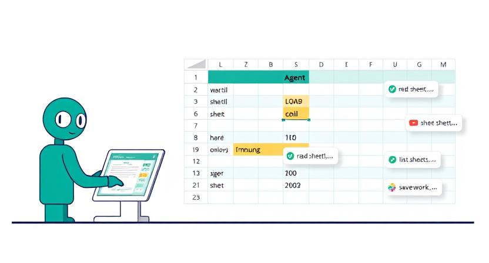

# MCP Excel Server

## Table of Contents

1. [What is MCP?](#what-is-mcp)
    - [MCP Server](#mcp-server)
    - [MCP Client](#mcp-client)
    - [MCP Tools](#mcp-tools)
2. [About MCP Excel Server](#about-mcp-excel-server)
3. [Available Tools](#available-tools)
    - [Workbook Tools](#workbook-tools)
    - [Worksheet Tools](#worksheet-tools)
    - [Range Tools](#range-tools)
    - [Excel Data Tools](#excel-data-tools)
4. [How to Use the Tools](#how-to-use-the-tools)
    - [Installation](#installation)
    - [Integration with AI Agents](#integration-with-ai-agents)
    - [Configuration for AI Agents](#configuration-for-ai-agents)
5. [MCP Inspector](#mcp-inspector)
6. [Contributing](#contributing)
7. [License](#license)

---

## What is MCP?

**MCP** stands for **Model Context Protocol**. It is an open protocol that standardizes how applications provide context to Large Language Models (LLMs). Think of MCP like a USB-C port for AI applications—it provides a standardized way to connect AI models to different data sources and tools.

MCP helps you build agents and complex workflows on top of LLMs by:
- Providing a growing list of pre-built integrations that your LLM can directly plug into
- Offering flexibility to switch between LLM providers and vendors
- Implementing best practices for securing your data within your infrastructure

### MCP Server
The **MCP Server** is a lightweight program that exposes specific capabilities through the standardized Model Context Protocol. It securely accesses local data sources (like your computer's files and databases) and remote services (available over the internet) to provide context to LLMs.

### MCP Client
The **MCP Client** is a protocol client that maintains a 1:1 connection with an MCP Server. It allows applications (like Claude Desktop, IDEs, or AI tools) to access data and tools provided by the server.

### MCP Tools
**MCP Tools** are specific capabilities exposed by MCP Servers. These tools enable LLMs to perform actions (e.g., creating a workbook, merging cells) and access data through a standardized interface.

---

## About MCP Excel Server



**MCP Excel Server** is an implementation of the MCP Server that provides tools for automating Excel file operations using Python and [openpyxl](https://openpyxl.readthedocs.io/). It allows you to:
- Create, open, and save Excel workbooks
- Add, rename, copy, move, and delete worksheets
- Read and write data to cells and ranges
- Merge, unmerge, copy, move, and delete cell ranges
- List available Excel files

---

## Available Tools

### Workbook Tools
- **[create_workbook](src/mcp_excel_server/tools/workbook_tools.py)**: Create a new Excel workbook
- **[get_workbook_info](src/mcp_excel_server/tools/workbook_tools.py)**: Get information about a workbook (sheets, properties)

### Worksheet Tools
- **[create_worksheet](src/mcp_excel_server/tools/worksheet_tools.py)**: Add a new worksheet
- **[delete_worksheet](src/mcp_excel_server/tools/worksheet_tools.py)**: Remove a worksheet
- **[rename_worksheet](src/mcp_excel_server/tools/worksheet_tools.py)**: Rename a worksheet
- **[copy_worksheet](src/mcp_excel_server/tools/worksheet_tools.py)**: Duplicate a worksheet
- **[move_worksheet](src/mcp_excel_server/tools/worksheet_tools.py)**: Change worksheet order
- **[get_worksheet](src/mcp_excel_server/tools/worksheet_tools.py)**: Get worksheet details
- **[list_worksheets](src/mcp_excel_server/tools/worksheet_tools.py)**: List all worksheets in a workbook

### Range Tools
- **[merge_range](src/mcp_excel_server/tools/range_tools.py)**: Merge a range of cells
- **[unmerge_range](src/mcp_excel_server/tools/range_tools.py)**: Unmerge a range of cells
- **[copy_range](src/mcp_excel_server/tools/range_tools.py)**: Copy a range of cells
- **[move_range](src/mcp_excel_server/tools/range_tools.py)**: Move a range of cells
- **[delete_range](src/mcp_excel_server/tools/range_tools.py)**: Delete a range of cells
- **[validate_range](src/mcp_excel_server/tools/range_tools.py)**: Validate a cell range

### Excel Data Tools
- **[read_data_from_excel](src/mcp_excel_server/tools/excel_data_tools.py)**: Read data from a worksheet
- **[write_data_to_excel](src/mcp_excel_server/tools/excel_data_tools.py)**: Write data to a worksheet
- **[merge_cells](src/mcp_excel_server/tools/excel_data_tools.py)**: Merge cells (alias)
- **[unmerge_cells](src/mcp_excel_server/tools/excel_data_tools.py)**: Unmerge cells (alias)
- **[list_excel_files](src/mcp_excel_server/tools/excel_data_tools.py)**: List all Excel files in the workspace

### Registering Tools

Tools in MCP Excel Server are registered using the `@mcp_tool` decorator. This decorator provides metadata about the tool, such as its name, description, and parameters. When the server starts, it automatically registers all tools, making them available for use by AI Agents.

---

## How to Use the Tools

### Installation

1. **Clone the repository:**
   ```bash
   git clone <repo-url>
   cd mcp_excel_server
   ```
2. **Install dependencies:**
   ```bash
   pip install -r requirements.txt
   ```

### Integration with AI Agents

MCP Excel Server is designed to be used with AI Agents like Claude, GitHub Copilot, and others. These agents can directly invoke the tools provided by the server without needing to send HTTP requests manually.

### Configuration for AI Agents

To integrate MCP Excel Server with AI Agents, follow these steps:

1. **Start the MCP Excel Server:**
   ```bash
   PYTHONPATH=src python src/mcp_excel_server/__main__.py sse
   ```

2. **Configure your AI Agent:**
   - For Claude Desktop, use the built-in MCP integration.
   - For GitHub Copilot, ensure your environment is set up to recognize the MCP Server's capabilities.

   **Configuration Examples:**

   **Stdio Transport Connection (for local integration):**
   ```json
   {
      "mcpServers": {
         "mcp-excel-stdio": {
            "command": "uvx",
            "args": ["mcp-excel-server", "stdio"]
         }
      }
   }
   ```

   **SSE Transport Connection:**
   ```json
   {
      "mcpServers": {
         "mcp-excel-server": {
            "url": "http://localhost:8800/sse"
         }
      }
   }
   ```
---

## MCP Inspector

**MCP Inspector** The MCP Inspector is an interactive developer tool for testing and debugging MCP servers. While the Debugging Guide covers the Inspector as part of the overall debugging toolkit, this document provides a detailed exploration of the Inspector's features and capabilities


For more detailed information on using the MCP Inspector, refer to the [official documentation](https://modelcontextprotocol.io/docs/tools/inspector).

---

## Contributing

Contributions are welcome! Please open issues or pull requests for bug fixes, new features, or documentation improvements.

---

## License

This project is licensed under the MIT License. 