# 🚀 Revolutionizing AI-Excel Integration: The MCP Protocol and My Excel MCP Server

*Imagine a world where your AI assistant can seamlessly work with your Excel files, just like a human colleague sitting next to you. No more copy-pasting, no more manual data entry, no more switching between applications. This isn't science fiction, it's happening right now, thanks to the Model Context Protocol (MCP) and my powerful Excel MCP Server.*

---

## 🌟 What is MCP? The Universal Language for AI

Think of MCP as the **"USB-C for AI applications"** a standardized protocol that allows AI models to connect to any data source or tool with the same ease you plug in your phone charger. But what makes MCP truly revolutionary?

### The Problem MCP Solves

Before MCP, integrating AI with different applications was like trying to speak to someone who only understands a different language. Each AI model had its own way of connecting to databases, files, and tools. This created a fragmented ecosystem where:

- 🔴 **Vendor Lock-in**: You were stuck with specific AI providers
- 🔴 **Complex Integration**: Every new tool required custom development
- 🔴 **Security Concerns**: Data had to be sent to external services
- 🔴 **Limited Capabilities**: AI couldn't access your local resources

### The MCP Solution: A Universal Translator

MCP introduces a standardized way for AI models to interact with the world around them. Here's how it works:

#### 🏗️ **MCP Architecture: The Three Pillars**

```mermaid
graph LR
    subgraph "AI Application (Claude, Copilot, etc.)"
        AI[🤖 AI Model]
        Client[MCP Client]
    end
    
    subgraph "Your Infrastructure"
        Server[MCP Server]
        Tools[MCP Tools]
        Data[(Your Data)]
    end
    
    AI -->|"Uses"| Client
    Client -->|"Connects via MCP Protocol"| Server
    Server -->|"Exposes"| Tools
    Tools -->|"Accesses"| Data
    
    style AI fill:#e1f5fe
    style Client fill:#f3e5f5
    style Server fill:#e8f5e8
    style Tools fill:#fff3e0
    style Data fill:#fce4ec
```



**How it works:**
1. **MCP Server** 🖥️
   - A lightweight program that exposes specific capabilities
   - Lives on your machine or infrastructure
   - Securely accesses your data and tools
   - Think of it as your AI's personal assistant

2. **MCP Client** 🔌
   - Connects to MCP servers (1:1 relationship)
   - Built into applications like Claude Desktop, IDEs, and AI tools
   - Acts as the bridge between AI and your tools

3. **MCP Tools** 🛠️
   - Specific capabilities exposed by servers
   - Standardized interface for AI to perform actions
   - Can be anything: reading files, writing data, making API calls

#### 🎯 **Why MCP is Game Changing**

- ✅ **Universal Compatibility**: Works with any MCP-compatible AI
- ✅ **Local Processing**: Keep your data secure on your infrastructure
- ✅ **Plug-and-Play**: Easy to add new capabilities
- ✅ **Open Standard**: No vendor lock-in, community-driven

---

## 🎯 Introducing My Excel MCP Server: Your AI's Excel Expert

Now, let's talk about something truly exciting my **Excel MCP Server**. I've taken the power of MCP and combined it with the world's most popular spreadsheet software to create something magical.

### 🎨 **The Vision Behind My Solution**

I asked myself: *"What if AI could work with Excel files as naturally as a human expert?"* The answer was to build an MCP server that doesn't just read Excel files, it **understands** them, **manipulates** them, and **creates** them with the precision of a seasoned data analyst.

### 🚀 **What Makes My Excel MCP Server Special**

#### **1. Comprehensive Excel Operations**
My server provides **20+ powerful tools** covering every aspect of Excel manipulation:


**📊 Workbook Management:**
- Create new workbooks with custom sheet names
- List and browse existing Excel files
- Get detailed workbook information
- Read and write data with precision

**📋 Worksheet Operations:**
- Create, rename, copy, move, and delete worksheets
- Merge and unmerge cells
- Advanced filtering capabilities
- Smart data manipulation

**🎯 Range Operations:**
- Copy, move, and delete cell ranges
- Validate ranges for data integrity
- Bulk operations for efficiency

#### **2. Intelligent Data Handling**
```python
# Example: Your AI can now do this seamlessly
@register_tool
def write_workbook_data(
    filepath: str,
    sheet_name: str,
    data: List[List],
    start_cell: Optional[str] = None
) -> Dict[str, Any]:
```

My tools are designed with **intelligence built-in**:
- **Auto-append**: Automatically finds the next available cell
- **Smart validation**: Ensures data integrity
- **Flexible ranges**: Read from specific cells or entire datasets
- **Preview mode**: Quick data inspection without loading everything

#### **3. Production-Ready Architecture**

I built it with modern Python technologies:
- **FastAPI**: Lightning-fast API responses
- **OpenPyXL**: Robust Excel file handling
- **Pydantic**: Type-safe data validation
- **Comprehensive Testing**: 100% reliability

### 🎭 **Real-World Scenarios: Where Magic Happens**

#### **Scenario 1: The Data Analyst's Dream**
*Sarah, a data analyst, needs to process 50 Excel files with customer data. Instead of spending hours manually opening each file, her AI assistant can:*

```mermaid
sequenceDiagram
    participant Sarah as 👩‍💼 Sarah
    participant AI as 🤖 AI Assistant
    participant MCP as 🖥️ Excel MCP Server
    participant Files as 📁 Excel Files
    
    Sarah->>AI: "Process all customer data files"
    AI->>MCP: list_workbooks()
    MCP-->>AI: List of 50 Excel files
    loop For each file
        AI->>MCP: read_workbook_data(file, "Customers")
        MCP->>Files: Read customer data
        Files-->>MCP: Customer data
        MCP-->>AI: Formatted data
        AI->>MCP: filter_rows_by_column("Revenue", ">10000")
        MCP-->>AI: High-value customers
    end
    AI->>MCP: write_workbook_data("summary.xlsx", filtered_data)
    MCP->>Files: Create summary report
    AI-->>Sarah: "Summary report created with 150 high-value customers"
```



```python
# AI automatically processes all files
for file in excel_files:
    # Read customer data
    data = read_workbook_data(file, "Customers", "A1", "Z1000")
    # Filter high-value customers
    filtered = filter_rows_by_column(file, "Revenue", ">10000")
    # Create summary report
    write_workbook_data("summary.xlsx", "High_Value", filtered)
```

#### **Scenario 2: The Financial Controller's Assistant**
*Mike, a financial controller, needs to consolidate monthly reports. His AI can:*

```mermaid
flowchart LR
    subgraph "Input Reports"
        A[📊 Jan Report]
        B[📊 Feb Report]
        C[📊 Mar Report]
    end
    
    subgraph "Processing"
        D[🖥️ Excel MCP Server]
        E[📋 Create Master Workbook]
        F[📋 Copy Jan Data]
        G[📋 Copy Feb Data]
        H[📋 Copy Mar Data]
        I[🔗 Merge Key Metrics]
    end
    
    subgraph "Output"
        J[📊 Consolidated Report]
    end
    
    A --> D
    B --> D
    C --> D
    D --> E
    E --> F
    F --> G
    G --> H
    H --> I
    I --> J
    
    style A fill:#e3f2fd
    style B fill:#e3f2fd
    style C fill:#e3f2fd
    style D fill:#e8f5e8
    style E fill:#e8f5e8
    style F fill:#e8f5e8
    style G fill:#e8f5e8
    style H fill:#e8f5e8
    style I fill:#e8f5e8
    style J fill:#f3e5f5
```



```python
# Create master workbook
create_workbook("Monthly_Consolidation.xlsx", "Summary")
# Copy data from multiple sources
for month in ["Jan", "Feb", "Mar"]:
    copy_worksheet(f"{month}_Report.xlsx", "Data", f"{month}_Data")
# Merge key metrics
merge_cells("Monthly_Consolidation.xlsx", "Summary", "A1", "D1")
```

#### **Scenario 3: The Sales Manager's Automation**
*Lisa, a sales manager, needs to track team performance. Her AI assistant:*

```mermaid
graph LR
    subgraph "Input Data"
        A[📈 Sales Data]
        B[👥 Team Members]
        C[🗺️ Regions]
    end
    
    subgraph "AI Processing"
        D[🤖 AI Assistant]
        E[🖥️ Excel MCP Server]
    end
    
    subgraph "Output"
        F[📊 Performance Dashboard]
        G[🏆 Top Performers]
        H[📋 Filtered Reports]
    end
    
    A --> D
    B --> D
    C --> D
    D --> E
    E --> F
    E --> G
    E --> H
    
    style A fill:#e8f5e8
    style B fill:#e8f5e8
    style C fill:#e8f5e8
    style D fill:#fff3e0
    style E fill:#e1f5fe
    style F fill:#f3e5f5
    style G fill:#f3e5f5
    style H fill:#f3e5f5
```



```python
# Create performance dashboard
create_workbook("Sales_Dashboard.xlsx", "Performance")
# Filter top performers
top_sales = filter_rows_by_columns(
    "sales_data.xlsx", 
    ["Sales_Rep", "Region"], 
    ["John", "West"]
)
# Write to dashboard
write_workbook_data("Sales_Dashboard.xlsx", "Performance", top_sales)
```

### 🛠️ **Technical Excellence: Under the Hood**

#### **Modular Design**
My architecture follows clean separation of concerns:

```mermaid
graph TD
    subgraph "MCP Excel Server Architecture"
        A[📁 src/mcp_excel_server/]
        
        subgraph "API Layer"
            B[🔧 api/tools/]
            B1[📊 workbook.py]
            B2[📋 worksheet.py]
            B3[🎯 range.py]
        end
        
        subgraph "Core Layer"
            C[⚙️ core/]
            C1[📊 workbook.py]
            C2[📋 sheet.py]
            C3[🎯 range.py]
            C4[🔍 validation.py]
        end
        
        subgraph "Support Layer"
            D[⚙️ config/]
            E[🛠️ utils/]
            F[📝 logger.py]
        end
        
        A --> B
        A --> C
        A --> D
        A --> E
        
        B --> B1
        B --> B2
        B --> B3
        
        C --> C1
        C --> C2
        C --> C3
        C --> C4
    end
    
    style A fill:#e1f5fe
    style B fill:#e8f5e8
    style C fill:#fff3e0
    style D fill:#f3e5f5
    style E fill:#f3e5f5
```



```
src/mcp_excel_server/
├── api/tools/          # MCP tool implementations
│   ├── workbook.py     # Workbook operations
│   ├── worksheet.py    # Worksheet management
│   └── range.py        # Cell range operations
├── core/               # Core business logic
├── config/             # Configuration management
└── utils/              # Shared utilities
```

#### **Smart Tool Registration**
I've created an elegant tool registration system:

```python
@register_tool
def create_workbook(filename: str, sheet_name: str = "Sheet1") -> Dict[str, Any]:
    """Create a new Excel workbook with intelligent defaults."""
```

Every tool is automatically:
- **Prefixed** with `EXCEL_MCP_` for clear identification
- **Registered** with the MCP server for discovery
- **Documented** with comprehensive docstrings
- **Type-safe** with proper validation

#### **Error Handling & Logging**
My robust error handling ensures your AI assistant never gets stuck:

```python
try:
    result = write_data(filepath, sheet_name, data, start_cell)
    return {"success": True, "message": result["message"]}
except (ValidationError, DataError) as e:
    return {"success": False, "message": f"Error: {str(e)}"}
```

### 🎯 **Getting Started: Your Journey Begins**

#### **Installation (It's Super Easy!)**
```bash
# Clone and install
git clone https://github.com/bassem-elsodany/mcp_excel_server
cd mcp_excel_server
pip install -r requirements.txt

# Start the server
PYTHONPATH=src python src/mcp_excel_server/__main__.py sse
```

#### **AI Agent Integration**
Configure your AI agent to use my server:

```json
{
   "mcpServers": {
      "mcp-excel-server": {
         "url": "http://localhost:8800/sse"
      }
   }
}
```

#### **Your First AI-Excel Interaction**
Once connected, your AI can immediately start working:

```mermaid
sequenceDiagram
    participant User as 👤 You
    participant AI as 🤖 AI Assistant
    participant MCP as 🖥️ Excel MCP Server
    participant Excel as 📊 Excel File
    
    User->>AI: "Create Project_Budget.xlsx with Expenses sheet"
    AI->>MCP: create_workbook("Project_Budget.xlsx", "Expenses")
    MCP->>Excel: Create new workbook
    Excel-->>MCP: Workbook created
    MCP-->>AI: Success confirmation
    AI-->>User: "Excel file created successfully!"
    
    User->>AI: "Add budget data: [['Item', 'Cost'], ['Laptop', 1200], ['Software', 500]]"
    AI->>MCP: write_workbook_data("Project_Budget.xlsx", "Expenses", data)
    MCP->>Excel: Write data to sheet
    Excel-->>MCP: Data written
    MCP-->>AI: Success confirmation
    AI-->>User: "Budget data added to Excel file!"
```



```
AI: "Create a new Excel file called 'Project_Budget.xlsx' with a sheet named 'Expenses'"
→ AI automatically calls create_workbook("Project_Budget.xlsx", "Expenses")

AI: "Add the following data to the Expenses sheet: [['Item', 'Cost'], ['Laptop', 1200], ['Software', 500]]"
→ AI automatically calls write_workbook_data with the data
```


### 🎉 **Join the Revolution**

The MCP protocol is transforming how we interact with AI, and my Excel MCP Server is at the forefront of this revolution. Whether you're a data analyst, financial professional, or just someone who works with Excel daily, this technology will change how you work.

**Ready to experience the future of AI-Excel integration?**

- 🚀 **Try it now**: Clone my [repository](https://github.com/bassem-elsodany/mcp_excel_server) and start experimenting
- 📚 **Learn more**: Check out my comprehensive [documentation](https://github.com/bassem-elsodany/mcp_excel_server#readme)

---

**🔗 Quick Links:**
- [GitHub Repository](https://github.com/bassem-elsodany/mcp_excel_server)
- [MCP Protocol Documentation](https://modelcontextprotocol.io/)
- [Installation Guide](https://github.com/bassem-elsodany/mcp_excel_server#how-to-use-the-tools)
- [API Documentation](https://github.com/bassem-elsodany/mcp_excel_server#available-tools)

**📝 License:** MIT License - Open source and free to use

---